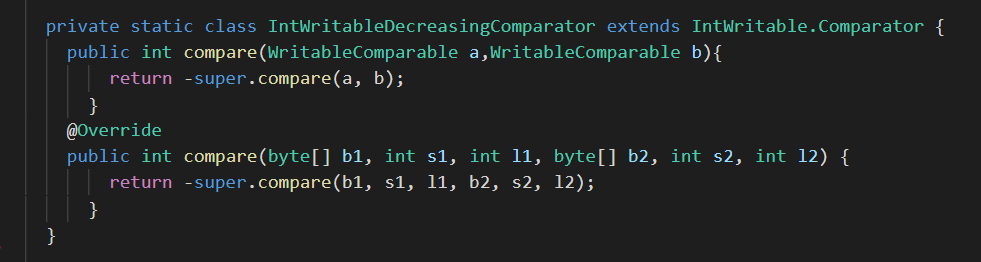
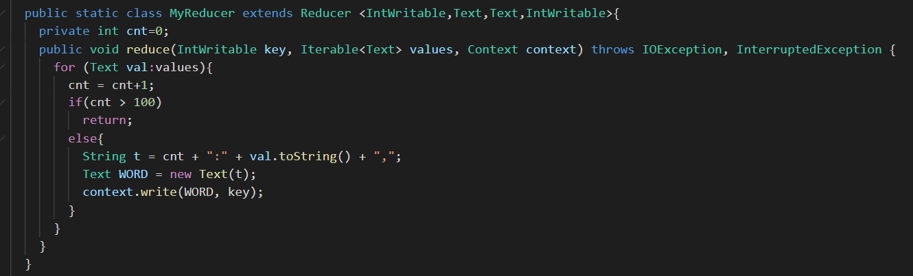
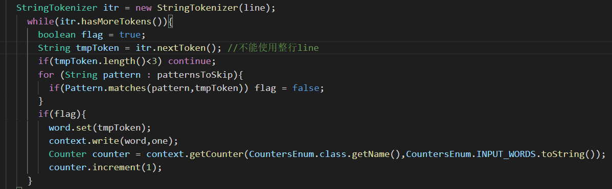
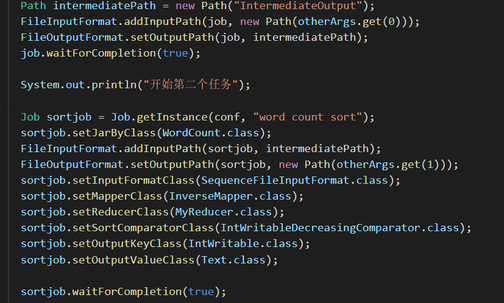
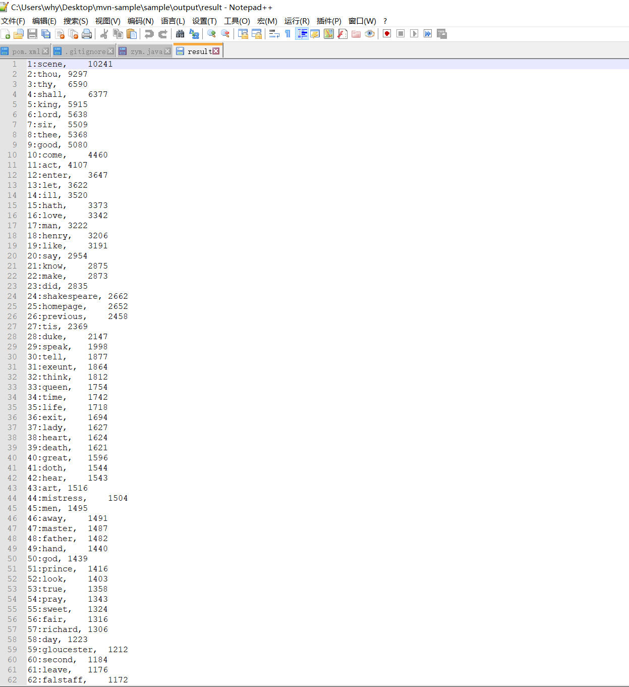
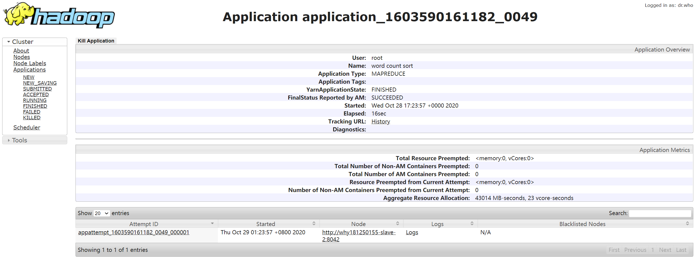

# 金融大数据 作业5
####  吴泓宇 181250155

## 设计思路

任务1：词频统计

该部分按照Wordcount 2.0思路实现即可

任务2：按照单词出现次数从大到小排列

该部分需要设计第二个Job，因为MapReduce程序默认的排序需要按照Key来排序，我们需要按照Value来排序，因此思路为将Key和Value对调，然后对Key排序就是对Value排序，此处需要调用InverseMapper。

此外，我们还需重写一个比较函数，来实现降序排列

任务3：输出前100个高频单词

在第二个Job上重新写一个Reducer即可，因为此时Key已经是排好序的，所以只要“数数”数到100然后截止计数就行了

任务4：忽略大小写

按照WordCount2.0的写法，设置环境变量，略

任务5：忽略标点符号（punctuation.txt）

我采用了正则表达式的方法，[\\pP+~$`^=|<>～｀＄＾＋＝｜＜＞￥×]可以过滤一切标点

任务6：忽略停词（stop-word-list）

这部分不能直接使用WordCount2.0的方法读文件，因为会造成包含在单词里面的模式被删除，造成单词缺失的情况，因此我们在获取完成pattern后，需要先对每个Line进行分词，再对分出来的每一个token进行匹配

任务7：忽略数字

正则表达式即可

任务8：单词长度>=3

对任务6中分出来的token进行一次判断即可。

主函数中的第二个job实现如下：

## 实验结果 

Web页面截图

## 总结

这次实验的难点在陌生的Java编程环境以及MapReduce程序的复杂编写上，在编写程序时，我曾由于一个Job的配置没有设置正确而卡壳了半天时间，而这些配置很多都只能从网上现有的资料中获取，准确性得不到保障，很令人糟心的一点就是：不是没有思路，而是有了思路之后面对的就是无从下手的编码。第一次编写MapReduce程序就使用到了两个Job，还使用了Key，Value反转排序的技术，成就感是有的，但这些思路和实现多半来源于互联网，啃代码、发现网上代码的错误也成为这次实验的很大一部分。

总的来说，这次实现的方案在第一个Map中效率明显不高，这是由于Pattern循环匹配的因素造成的，若停词数为N，输入行数为M，每行的单词数平均为P，那么这个算法的时间复杂度就为O(NMP),还是相当可观的，也体现了并行化的优势。排序过程倒是执行的很快，大概是内部的排序实现机制的结果。